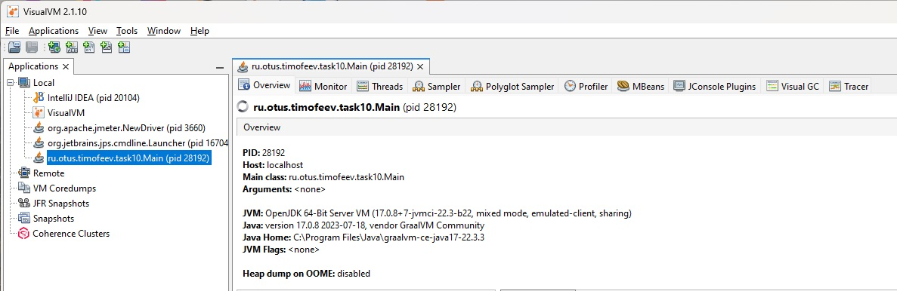
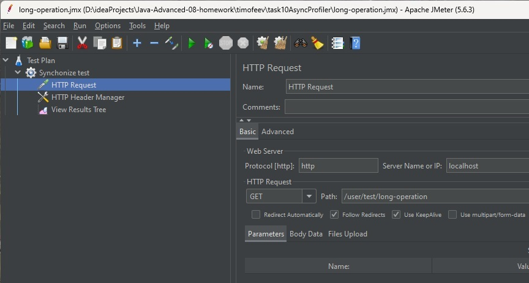
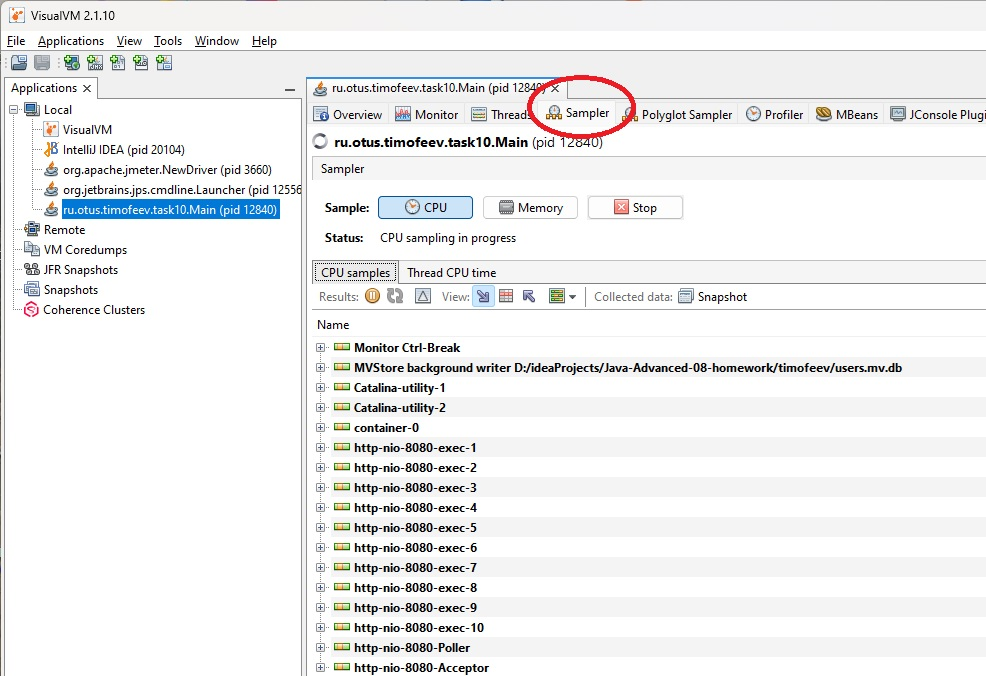
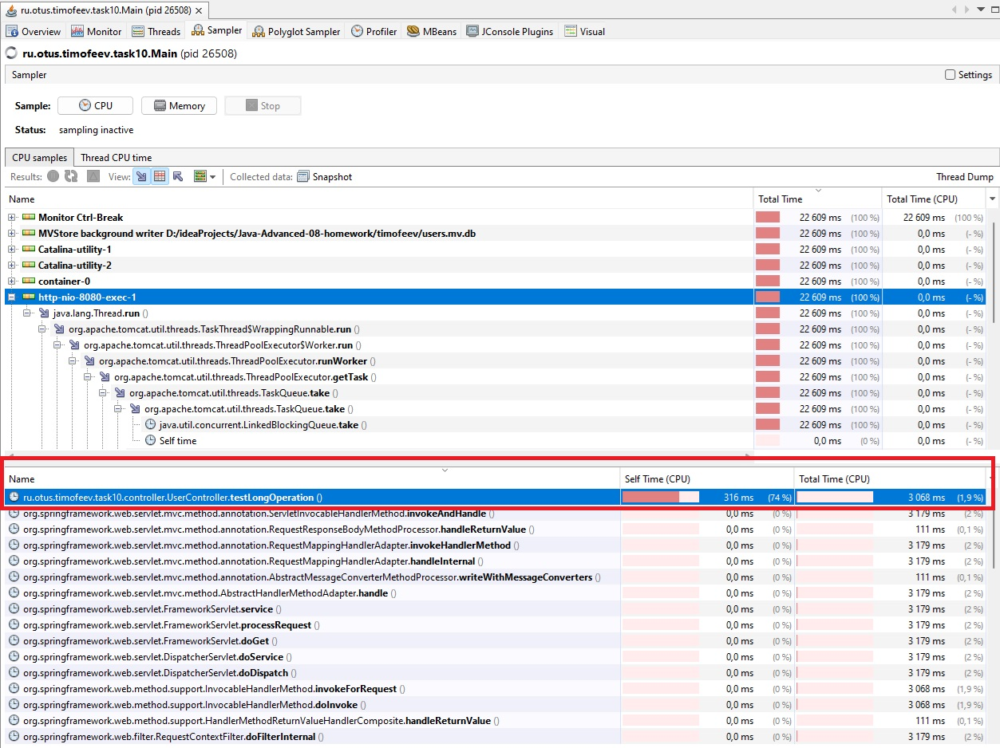

**Задание**

Реализовать тестовый пример, содержащий проблемы, которые потом продемонстрировать в visualvm

**Как воспроизвести работу приложения:**

После клонирования проекта, выполнить команду _mvn package_ , перейти в директорию, в которую сбилделся jar файл,
и затем попустить приложение с помощью комады

`mvn package`

`java -jar ./target/task10AsyncProfiler.jar`

**Тестируем ендпойт /user/test/long-operation , в котором есть долгая операция обработки http запроса**

```
    double sumOfSqrt = 0.0 ;
    for (int j = 0; j < 1_000_000; j++)
        sumOfSqrt += Math.sqrt(random.nextInt());
```

Запускаем visualvm и подключаемся к приложению `ru.otus.timofeev.task10.Main`



Запускаем Jmeter открыв в нем файл проекта long-operation.jmc и подаем нагрузку



Запускаем сэмплирование



Останавливаем и смотрим результаты



Делаем вывод, что на метод `ru.otus.timofeev.task10.controller.UserController.testLongOperation` тратится 74% от всего 
времени работы CPU