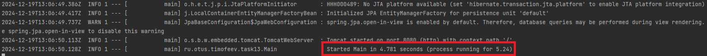

**Задание:**

Описать Dockerfile или docker-compose конфиг, для запуска вашего приложения на порту 8080 из docker-конетйнера

**Как воспроизвести работу приложения:**

После клонирования проекта, перейти в директорию ./task13Docker

В терминале запусть команду для билдинга докер контейнера

```bash
docker build ./ -t app:1.1
```

...


Запустить докер котейнер

```bash
docker run -p 8080:8080 app:1.1
```


...


Сделать тестовый http request для создания пользователя


Получить http responce


