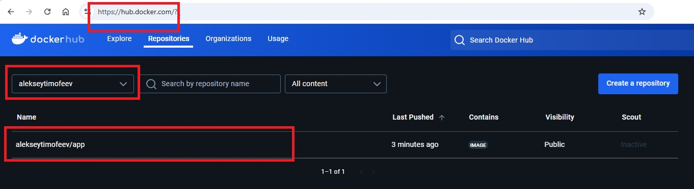
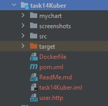
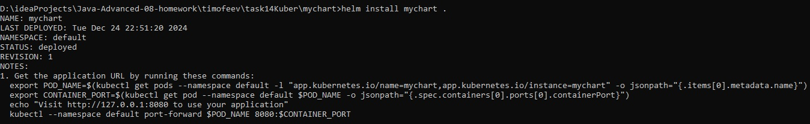
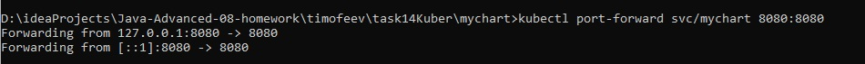
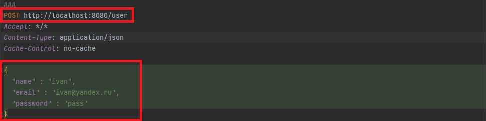
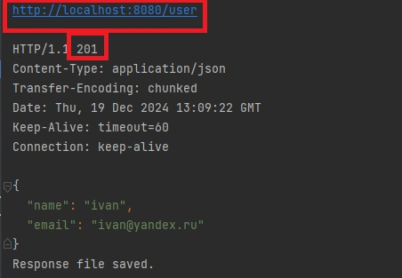

**Задание:**

Используем готовое приложение с домашнего задания “Вспоминаем Docker”
Необходимо написать Chart, который будет шаблонизировать объекты Deployment Service
Заполнить values.yaml для приложения
Осуществить деплой в кластер kubernetes
Получить ответ со своих эндпоинтов

**Как воспроизвести работу приложения:**

После клонирования проекта, перейти в директорию ./task14kuber

Собрать docker image и запушить его в личный репозиторий docker hub

```bash
docker build ./ -t app:1.1
```

```bash
docker tag app:1.1 DOCKER_HUB_USERNAME/app:1.1
```

```bash
docker push DOCKER_HUB_USERNAME/app:1.1
```

Созданный docker image появится в репозитории по адресу https://hub.docker.com/



Создаем helm chart

```bash
helm create mychart
```

Появятся директория deployment с файлами Chart.yaml, values.yaml и диреторией templates


Изменить файл ./mychart/values.yaml

```
image:
  repository: alekseytimofeev/app
  pullPolicy: Always
  tag: "1.1"
  
service:
  port: 8080
 ```

Деплоим

```bash
cd mychart
```

```bash
helm install mychart .
```



```bash
kubectl port-forward svc/mychart 8080:8080
```


Сделать тестовый http request для создания пользователя



Получить http responce



