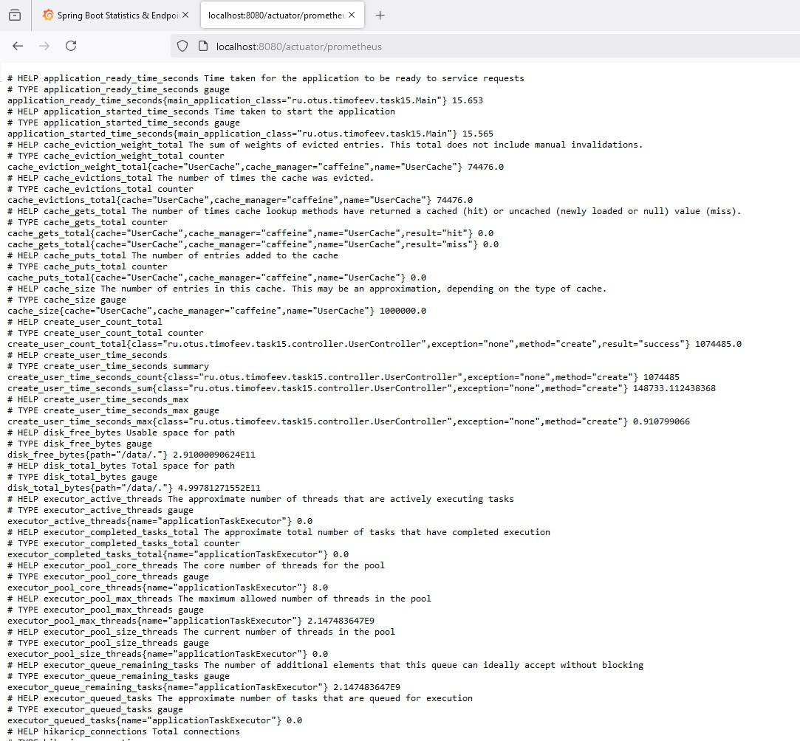
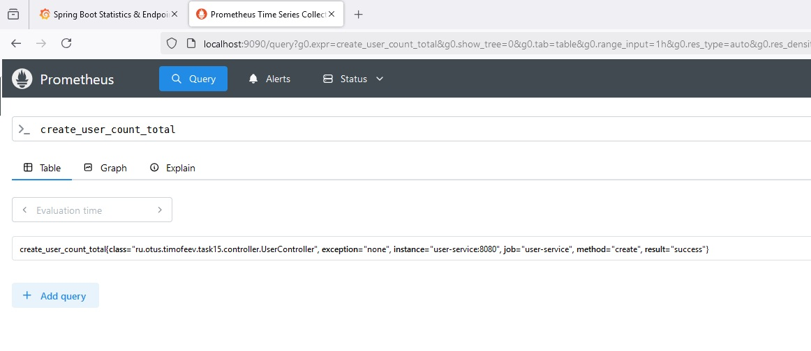
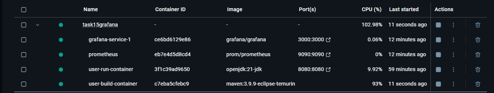
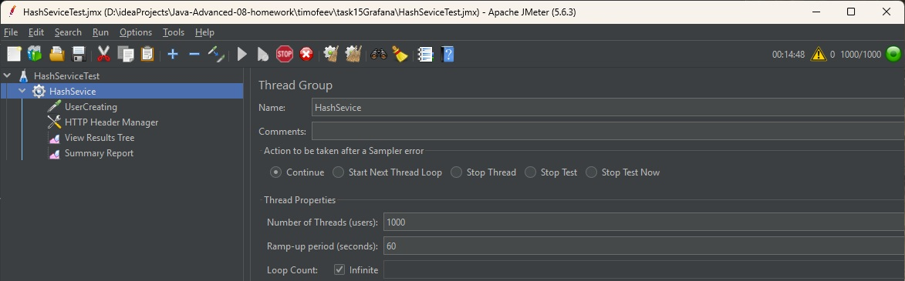
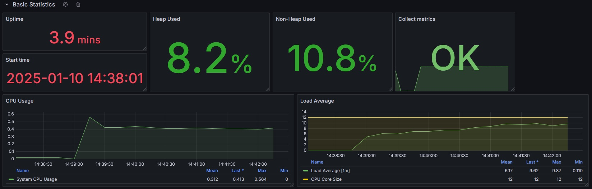
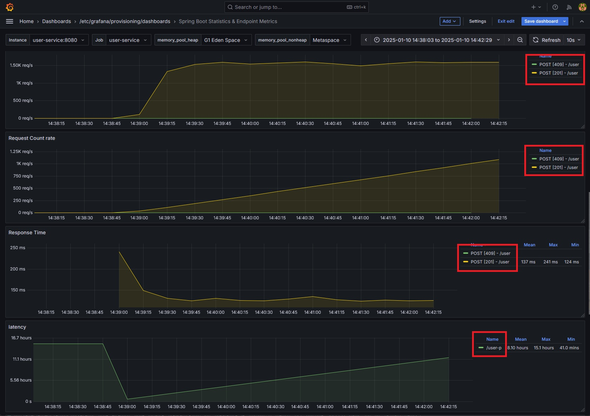
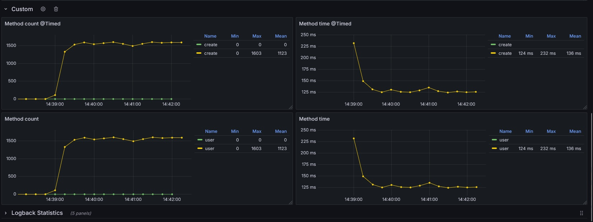

**Задание:**

Покрыть Rest сервис метриками, построить дашборд к Grafana и продемонстрировать результаты дашборда, подавая нагрузку 
через JMeter

**Как воспроизвести работу приложения:**

После клонирования проекта, перейти в директорию ./task15Grafana, поднять docker контейнеры командой

```bash
docker compouse up
```

Внутри приложения работают эндпоинты по адресу localhost:8080/actuator/prometheus


Сервер метрик prometheus доступен по порту localhost:9090


После запуска всех контейнеров подать нагрузка на приложение через JMeter




Графана доступна на адресу localhost:3000, Дашбоард загружен из файла otus.json







