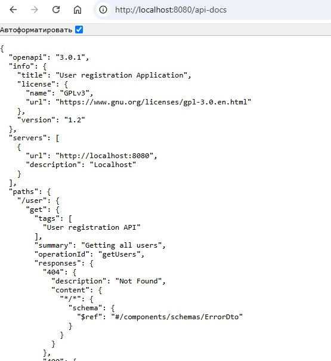
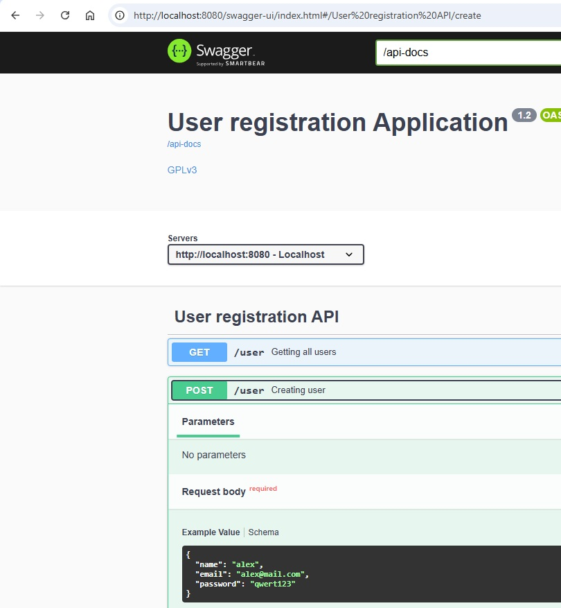

**Задание:**

1) Подключить springdoc в проект
2) Описать DTO и параметры эндпойтов аннотациями из OpenAPI (@Schema, @Parameter)
3) Настроить эндпойнт для OpenAPI по адресу /api-docs
4) Подключить SwaggerAPI и замапать его на /api-docs-ui

**Как воспроизвести работу приложения:**

После клонирования проекта, выполнить команду _mvn package_ , перейти в директорию, в которую сбилделся jar файл,
и затем попустить приложение с помощью комады

`mvn package`

`java -jar ./target/task16Swagger.jar`

json-описание рест-методов доступно по http://localhost:8080/api-docs

графическое описание доступно по http://localhost:8080/swagger-ui/index.html

