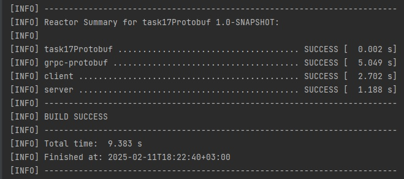
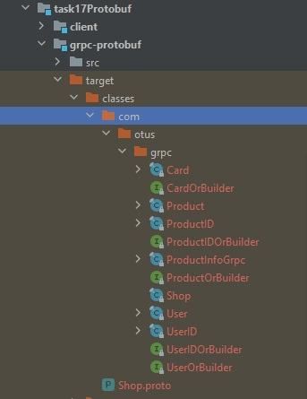
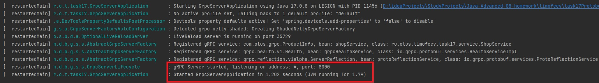
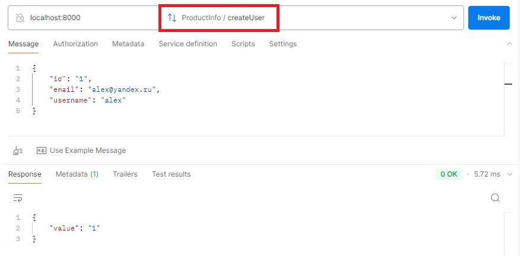
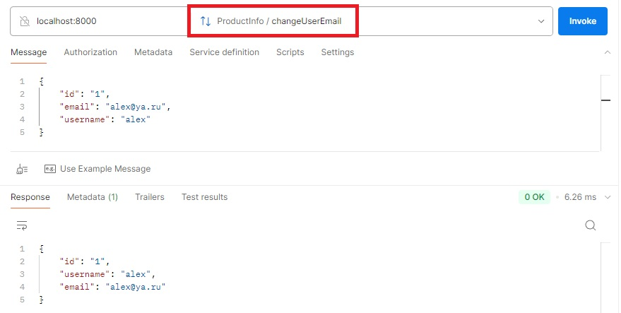
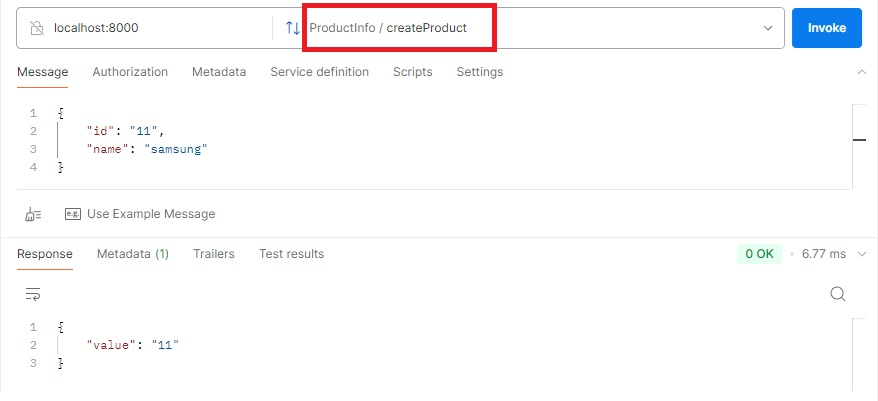
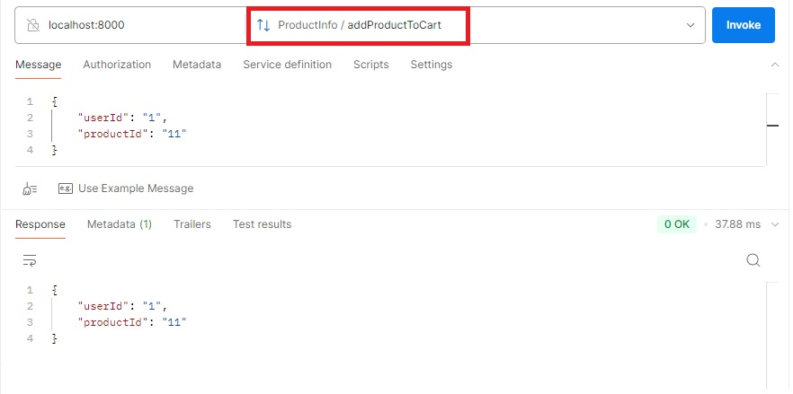

**Задание**

Описать gRPC сервис
Подключить gRPC в проект и Реализовать сервис в Java
Описать сущности при помощи protobuf:

User (email, username, id)
Product (name, id)

Описать сервис при помощи protobuf:

createUser(email, username) returns id
changeUserEmail(id, email)
changeUserName(id, username)
createProduct(name) returns id
addProductToCart(usderId, productId)

**Как воспроизвести работу приложения:**

После клонирования проекта, выполнить команду _mvn package_ . Сбилдятся 3 модуля проекта

В результате будут автоматически сгенерированы классы реализаций методов gRPC сервиса

Запустить модуль сервера командой `java -jar ./server/target/server-1.0-SNAPSHOT.jar`

Протестить gRPC сервер

