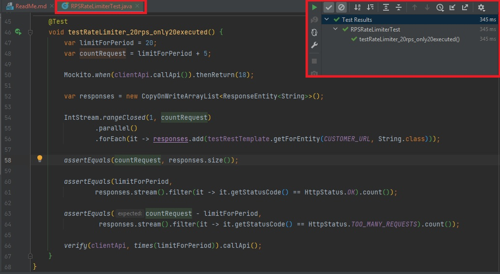
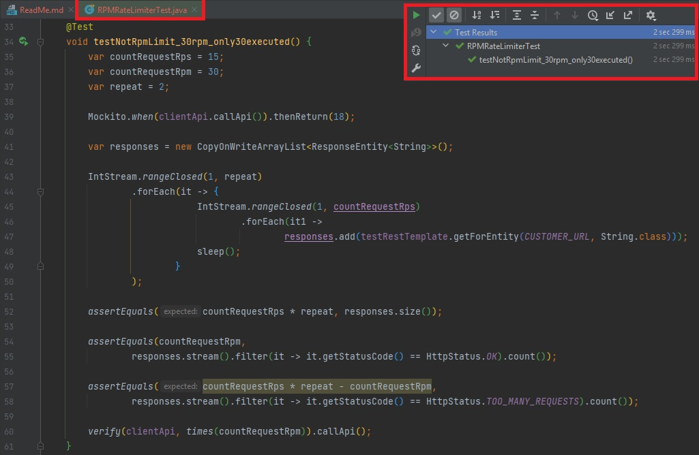
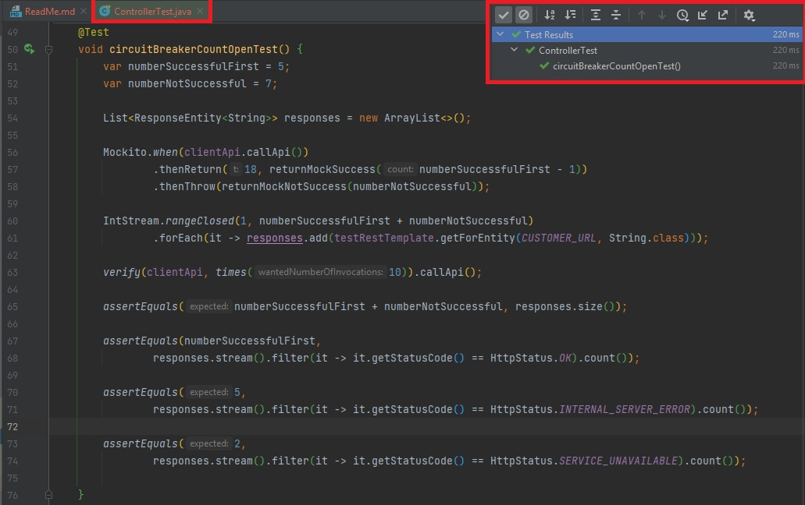

**Задание**

1) Создать новый Rest или gRPC сервис
2) Добавить в контроллер метод получения возраста пользователя по его id (возраст можно формировать рандомно)
3) Сделать защиту от перегрузки метода, используя RateLimiter из библиотеки resilience4j:

не более 20 запросов в секунду
не более 30 запросов в минуту

4) Сделать защиту от ошибок с использованием CircuitBreaker из библиотеки resilience4j, если:

50% запросов за последние 10 секунд не были выполнены (SlidingWindowType.TIME_BASED)

5) Написать тесты:

метод не позволяет выполнить более 20 запросов в секунду
метод не позволяет выполнить более 30 запросов в минуту
метод не выполняется, если 50% запросов за последние 10 секунд были не успешные

**Результаты**

метод не позволяет выполнить более 20 запросов в секунду

метод не позволяет выполнить более 30 запросов в минуту

метод не выполняется, если 50% запросов за последние 10секунд были не успешные
