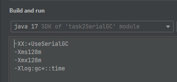
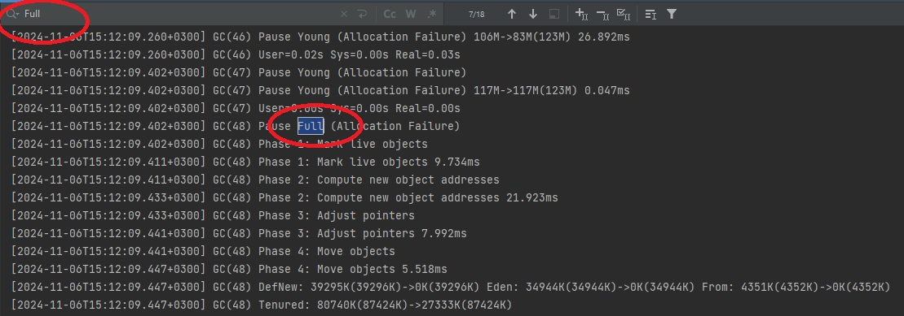
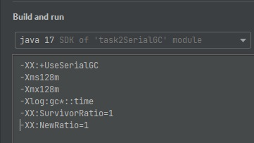
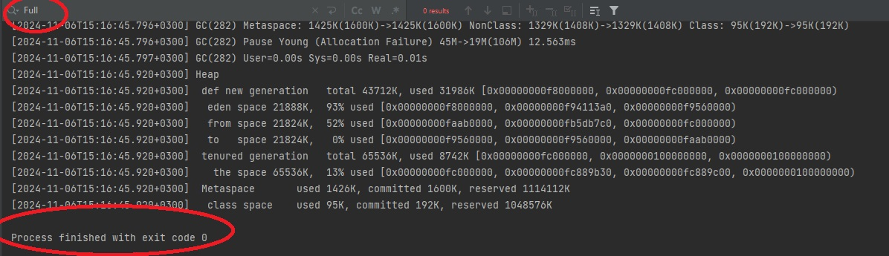

**Задание:**

Оптимизация SerialGC

Настроить -XX:SurvivorRatio=? или/и -XX:NewRatio=? так что бы приложение не запускало полную сборку до конца своего выполнения

**Как воспроизвести работу приложения:**

1. Запустим приложение с параметрами виртуальной машины: -XX:+UseSerialGC -Xms128m -Xmx128m -Xlog:gc*::time

Из логов видно, что приложение запускало полную сборку мусора 18 раз

2. Добавим в параметры виртуальной машины -XX:SurvivorRatio=1 и -XX:NewRatio=1

3. Запустим приложение и проанализируем логи

За все время работы приложение ни разу не запускало полнуюсборку мусора