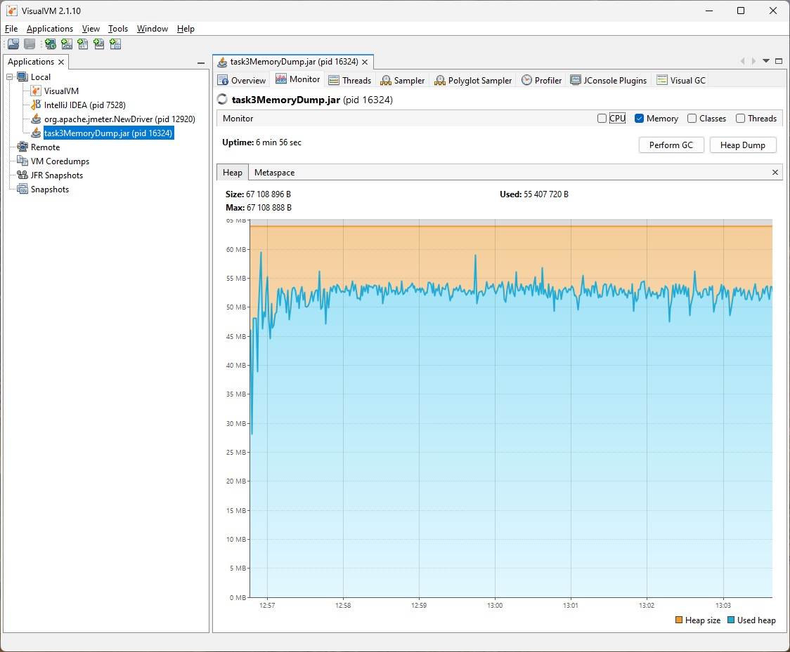

**Задание:**

1. Реализоавть простое приложение на spring boot:

1.1 Сервис регистрации пользователя в системе: rest service принимающий login и password от пользователя
1.2 Для хранение данных использовать БД H2
1.3 Для доступа к данным использовать Spring JPA

2. Заложить проблему, вызывающую OutOfMemoryError.

3. Запускать приложение с инструкцией, позволяющей собирать дамп хипа перед падением

4. Провести анализ дампа инструментам Eclipse Memory Analyzer Tool, найти утечку, и предоставить скиншот того места,
   где можно сделать вывод об утечку

5. Поправить утечку памяти.

**Как воспроизвести работу приложения:**

После клонирования проекта, выполнить команду _mvn package_ , перейти в директорию, в которую сбилделся jar файл,
и затем попустить приложение с помощью комады

_java  -Xms64m -Xmx64m -XX:+HeapDumpOnOutOfMemoryError -jar task3MemoryDump.jar_

Убедиться в работостособности работы севрвера с помощью http запросов. Можно использовать инструментарий Idea с файлом
http запросов user.http

**Запустить нагрузочное тестирование:**

Запустить jMeter с файлом user.jmx

и запустить visualVm, подключившись к соответствующему процессу

Спустя около 6 минут приложение упадает с `java.lang.OutOfMemoryError: Java heap space` c созданным файлом дампа хипа 
java_pid***.hprof

**Запустить MemoryAnalyzer с выбранным файло м дампа хипа**

Выбрать Reports -> Leak Suspects

Первый пункт указывает на утечку памяти: CaffeineCache содержить 38.74 % всех объектов хипа

**Изменить настройки CaffeineCache в файле application.yml**

В файле _application.yml_ установить поле `expireInMinutes` в значение 1

**Пересобрать проект, запустить нагрузочное тестирование и убедиться в отсутствии утечки памяти**

Спустя 6 минут (время падения приложения с предыдущими настройками кеша) стабильно работает, а значение хипа памяти 
держится на одном уровне

