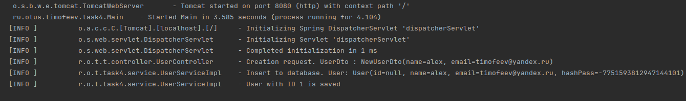
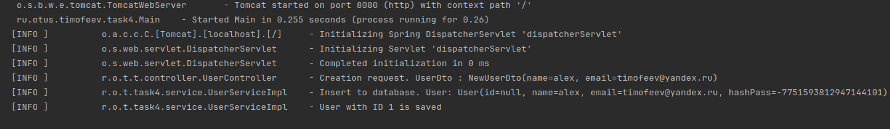
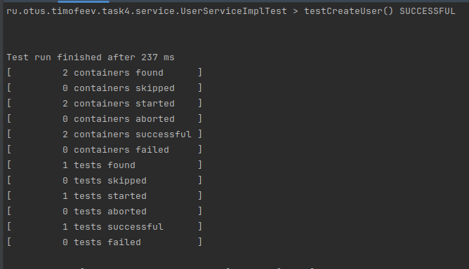

**Задание:**

2. Добавить плагин для сборки Native Image файлов

3. Выполнить сборку в Native Image

4. Запустить полученный файл и сравнить время запуска с запуском на JVM

5. Зафиксировать результаты (можно указать железо на котором выполнялся запуск)

6. Добавить простой unit тест и запустить native:test

**Как воспроизвести работу приложения:**

После клонирования проекта, выполнить команду _mvn package_ , перейти в директорию, в которую сбилделся jar файл,
и затем попустить приложение с помощью комады

`mvn package`

`java -jar ./target/task4GraalVM.jar`

Обратить внимание на то, что запуск сервера занял около **3.5** секунд

Выполнить сборку нативного образа и запустить его

`mvn -Pnative native:compile`

`./target/task4GraalVM`

Время запуска сервера составило около **0.25** секунды

Выполнить сборку тестов нативного образа и запустить его

`mvn -PnativeTest spring-boot:process-test-aot`

`mvn -PnativeTest native:test`

`./target/native-tests`

Убедиться, что тест прошел успешно

