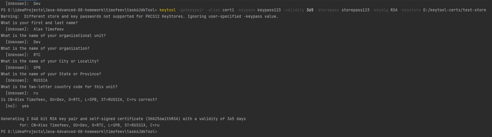
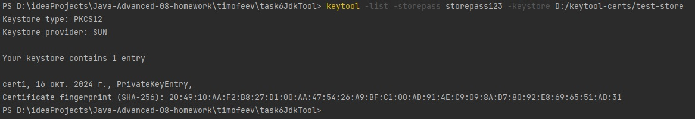
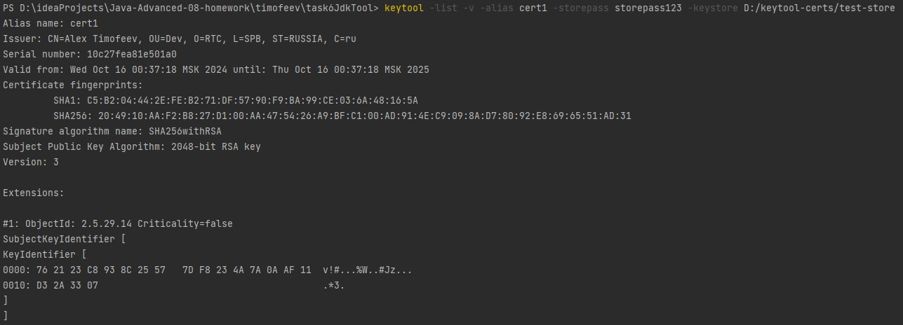
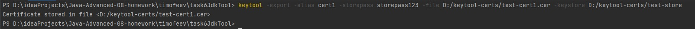
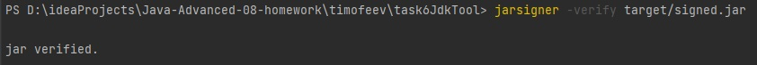
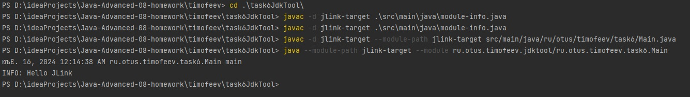
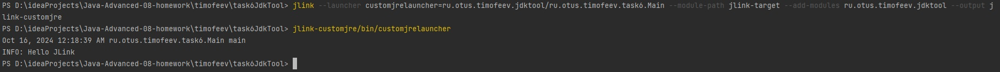

**Задание:**

1 keytool & jarsigner
Выпустить самоподписанный сертификат, подписать им jar-файл(из одного класса с методом main()), верифицировать подпись
2 jlink
Написать класс с одним методом main(), и из него собрать custom lighthweight jre, и запустить свою программу с помощью 
этой jre

# keytool, jarsigner

1. Создать сертификат (D:/keytool-certs/)

```bash
keytool -genkeypair -alias cert1 -keypass keypass123 -validity 365 -storepass storepass123 -keyalg RSA -keystore D:/keytool-certs/test-store
```



2. Просмотреть сертификаты

```bash
keytool -list -storepass storepass123 -keystore D:/keytool-certs/test-store
```



3. Просмотреть сертификат cert1

```bash
keytool -list -v -alias cert1 -storepass storepass123 -keystore D:/keytool-certs/test-store
```



4. Экспортировать сертификат cert1 в хранилище

```bash
keytool -export -alias cert1 -storepass storepass123 -file D:/keytool-certs/test-cert1.cer -keystore D:/keytool-certs/test-store
```




5. Подписать jar файла

```bash
jarsigner -keystore D:/keytool-certs/test-store -signedjar target/signed.jar target/task6JdkTool-SNAPSHOT.jar cert1
```

6. Проверить подпись

```bash
jarsigner -verify target/signed.jar
```




# jlink

1. Скомпилировать модуль

```bash
javac -d jlink-target .\src\main\java\module-info.java
```

2. Скомпилировать класс

```bash
javac -d jlink-target --module-path jlink-target src/main/java/ru/otus/timofeev/task6/Main.java
```

3. Запустить программу
```bash
java --module-path jlink-target --module ru.otus.timofeev.jdktool/ru.otus.timofeev.task6.Main
```



4. Собрать кастомную jre

```bash
jlink --launcher customjrelauncher=ru.otus.timofeev.jdktool/ru.otus.timofeev.task6.Main --module-path jlink-target --add-modules ru.otus.timofeev.jdktool --output jlink-customjre
```
5. Запустить программу из собранной jre

```bash
jlink-customjre/bin/customjrelauncher
```



6. Сравнить объем занимаемой памяти на диске кастомной jre и graalvm-ce-java

_Кастомная jre занимает 74,1 МБ, graalvm-ce-java17-22.3.3 - 613 МБ_

