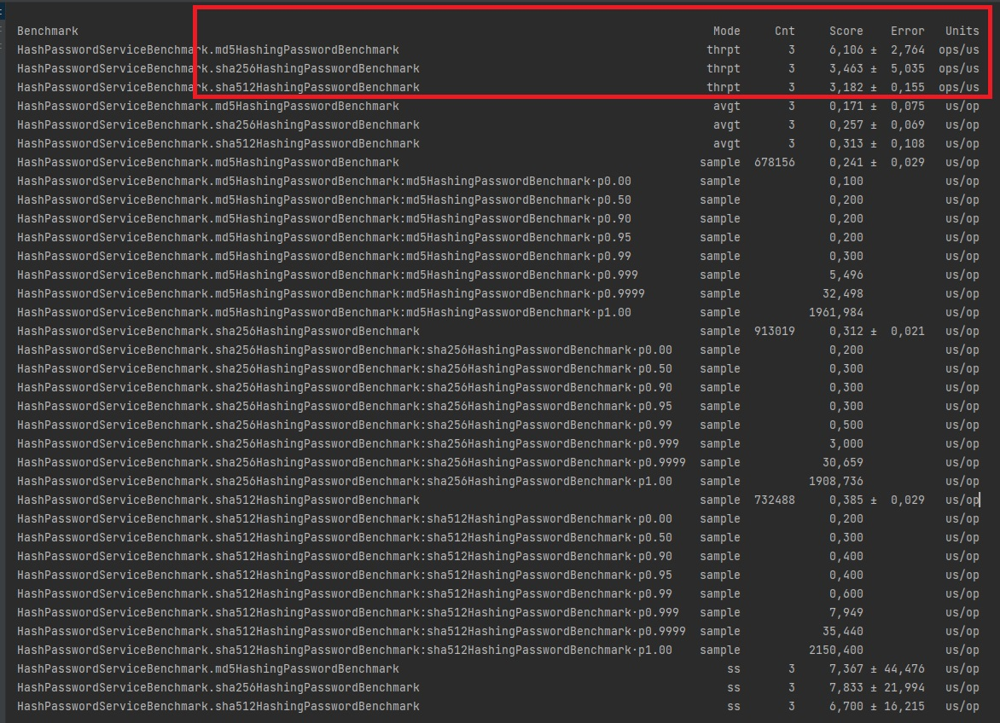
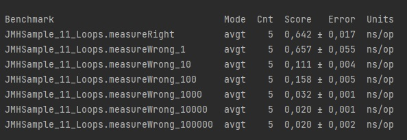
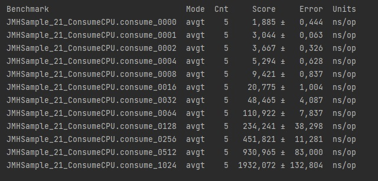

**Задание:**

Реализовать тесты по замеру производительности с помощью JMH

Добавить в сервис регистрации логику по хешированию пароля с последующим сохранением хеша в БД
Реализовать несколько тестов по производительности:
тест на логику хэширвования пароля с применением 3 разных алгоритмов: Md5, sha256, sha512
Цель тестов - обоснованно выбрать более производительный вариант

**Тест прозводительности на логику хэширвования пароля с применением 3 разных алгоритмов: Md5, sha256, sha512**

**Итоги**
Самым быстрым алгоритмом хеширования оказался MD5, способный обрабатывать в среднем 6.106 операций в микросекунду. 
Алгоритм SHA256 и SHA512 показали схожие результаты: 3.463 и 3.182 операций в микросекунду соответственно.

**Зауск 3 различных тестов от org.openjdk.jmh.samples**

**JMHSample_01_HelloWorld**

**JMHSample_11_Loops**

**JMHSample_21_ConsumeCPU**

