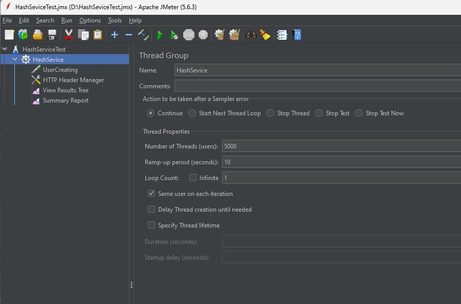
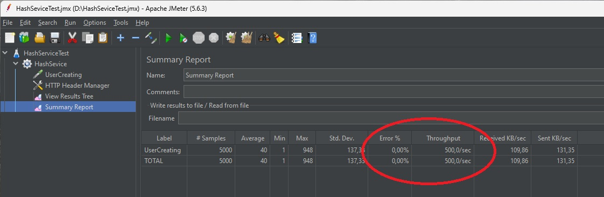
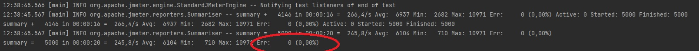
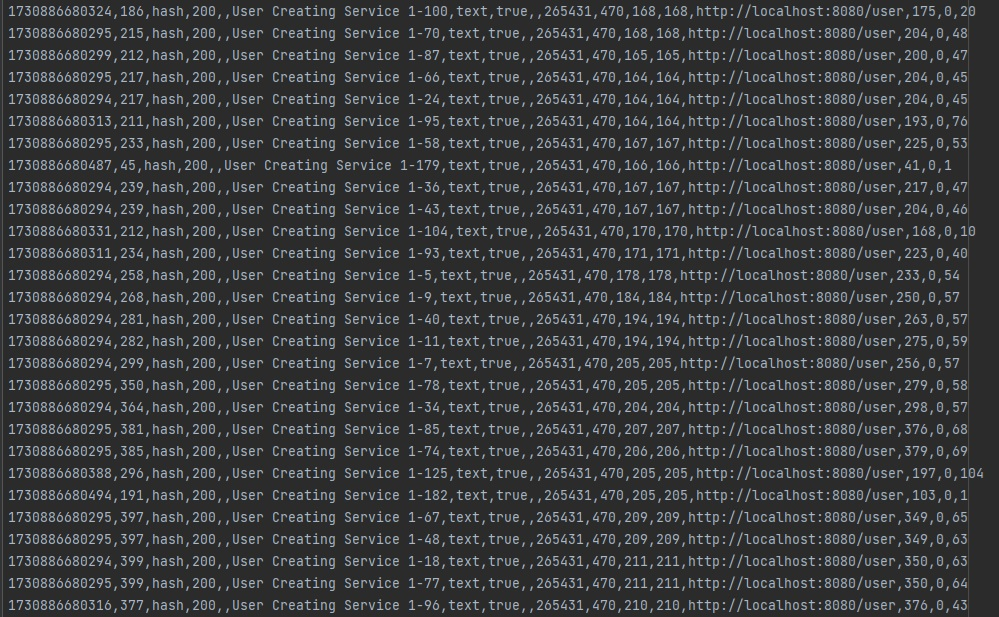

**Задание**

Сделать генератор нагрузки для выбранного протокола

Создать тестовый план с регулиремым RPS.
1)Сделать тесты через UI-ный интерфейс Jmetera
2)Сделать тесты через отдельный подмодуль с библиотекой Jmeter.
При старте данного подмодуля jar должен запускаться и генерировать нагрузку на основное приложение

**Как воспроизвести работу приложения:**

**Запуск через UI-ный интерфейс Jmeter**
1. Установить JMeter и создать переменную окруения JMETER_HOME
2. Запустить JMeter и открыть проект ./jmeter/HashServiceTest.jmx
3. Склонировать, собрать и запустить сервер регистрации пользователя
    
    `cd task3MemoryDump `

    `mnv package`

    `java -jar ./target/task3MemoryDump.jar`

4. Проверить установленные параметры тестирования в секции Thread Properties

   `Number of Thread (users): 5000 (количество http запросов за время тестирования)`

   `Ramp-up period (seconds): 10 (время тестирования)`

    `Loop Count: 1 (количество циклов)`

**Итого получаем нагрузку в 500 запросов в секунду (5000 / 10 = 500 RPS)**

5. Запустить тестирование и после 10 секунд проверить результаты открыв элемент Summary Report

6. Убеждаемся, что сервер выдерживает нагрузку. Стобцы Error - 0% и Throughput - 500.0/sec соответствуют ожиданиям

**Запуск через отдельный подмодуль с библиотекой Jmeter**

1. Запустить сервер регистрации пользователей аналогично способом описанном выше
2. Запустить модудь с библиотекой Jmeter

   `cd task8JMeter `
   
   `mnv package`
   
   `java -jar ./target/task8JMeter.jar`

3. Просмотреть результаты тестирования в логах. Убедиться, что все запросы выполнелись без ошибки

4. В файле ./jmeter/pt-logs.jtl можно просмотреть подробный результат тестирования

