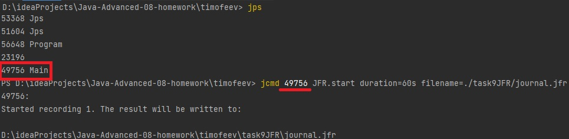

**Задание**

Реализовать тестовый пример, содержащий проблемы, которые потом продемонстрировать в JFR
1) Для выполнения задания потребуется сервис регистрации пользователя, реализованный ранее.

2) Написать тестовый профиль с использованием JMeter

3) Провести профилирование приложения с помощью JFR

4) Имитировать проблемы в приложении:
- лишние исключения
- лишние запросы в БД
- ненужные блокировки synchronized

5) На основе анализа журнала JFR найти проблемы в приложении и обосовать, как прийти к такому заключению о проблемах


**Как воспроизвести работу приложения:**

После клонирования проекта, выполнить команду _mvn package_ , перейти в директорию, в которую сбилделся jar файл,
и затем попустить приложение с помощью комады

`mvn package`

`java -jar ./target/task9JFR.jar`

**Тестируем ендпойт /user/test/synchronize , в котором есть блокировка потока обработки http запроса**  

```
synchronized (MessageDto.class) { 
    Thread.sleep(200);
}
```

С помощью команды jps выясняем PID процесса и запускам JFR подставив нужный PID

`jcmd <pid> JFR.start duration=60s filename=record.jfr`



Запускаем Jmeter открыв в нем файл проекта jfrtest.jmc и подаем нагрузку.


После минуты результаты профилирования будут в файле record.jfr, который необходимо открыть в Java Mission Control

Открываем вкладку **Lock Instances**, который помечен красный восклицательным знаком.


Ображаем внимание, что все потоки executor - обработчика http запросов были заблокированы от 6 до 42 раз. А из стэк трейса
видно, что блокировака происходит в методе Controller::testSynchronize. 


